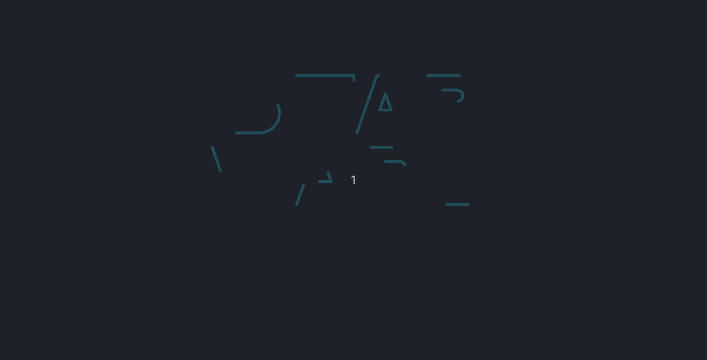

## How I created and deployed this app

1. npx create-react-app star-wars-planets
2. npm install gh-pages --save-dev
3. npm install react-router-dom --save
4. `package.json`:
	- "homepage": "https://Vincenzofdg.github.io/Star-Wars-Planets",
	- "predeploy": "npm run build",
	- "deploy": "gh-pages -d build",

## Knowledges:

 - Context API;
 - React Hooks;
 - useState and useEffect;
 - Custom Hooks.

## Preview:

